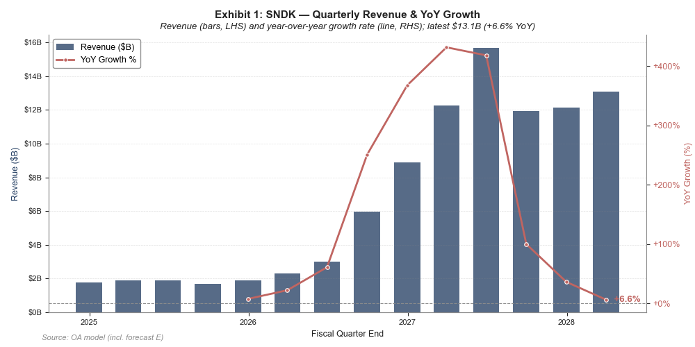
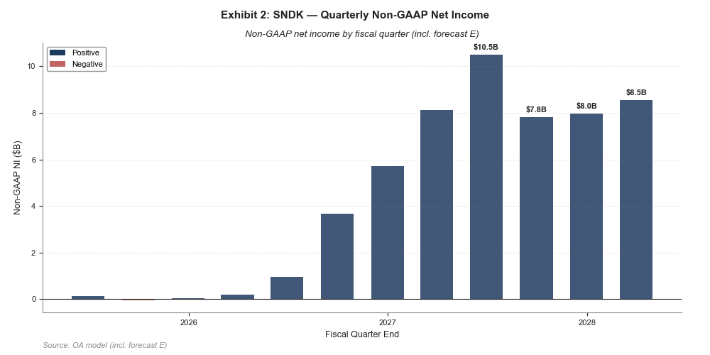
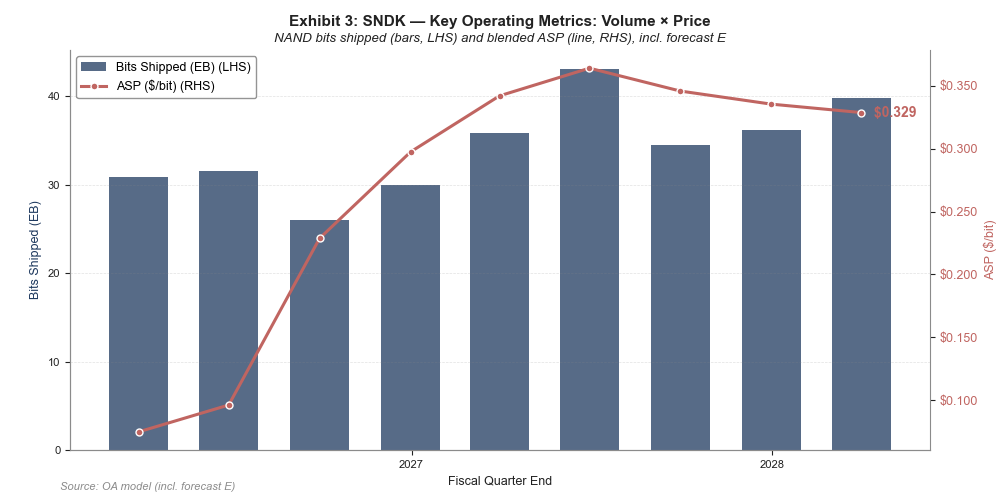

# Sandisk (SNDK): BUY | NAND 超级周期 × NBM 模式重塑——盈利结构性重估尚未被充分定价
*United States | Semiconductors | NAND Flash 存储 · Sandisk Corporation (SNDK) · June 11, 2026*

| RATING | PRICE | PRICE TARGET | FWD P/E | 52W HIGH-LOW | MARKET CAP | TICKER |
| --- | --- | --- | --- | --- | --- | --- |
| BUY | $1,646.54^ | $1,900（OA target，手动上调） | 9x | $39.44-$1,861.00 | $244B | SNDK |

**我们首次覆盖 Sandisk (SNDK) 给予买入评级。核心论点一句话：这不是一轮普通的 NAND 涨价周期，而是「AI 数据中心需求结构性爆发」叠加「NBM 长协模式重塑商业范式」共同驱动的盈利结构性重估，而当前 forward P/E 仅 9x 尚未为后者定价。三大支柱：(1) AI 推理/KVCache 驱动数据中心 NAND 需求，CY26 数据中心 exabyte 增长预期已从 mid-20% 连续上调至 mid-70%+，数据中心首次超越移动成为 NAND 最大市场；(2) 公司已签 5 份 NBM 多年期供给协议（RPO $42B、金融担保 $11B、FY27 超 1/3 比特锁定），把一次性商品销售改造成可见度高的类订阅收入，从根本上削弱周期性；(3) BiCS8 CBA 节点 + Stargate QLC 平台构建企业级 SSD 差异化壁垒，叠加全行业供给纪律与公司零债务、49.7% FCF 利润率。FQ3'26 已全面兑现：营收 US$5,950m、毛利率 78.4%、经营利润率 70.9%、EPS 23.41，均创历史纪录。**

**核心预期差。** 市场仍按纯周期商品股给 SNDK 定价——「NAND 涨价见顶即杀估值」是 forward P/E 压在 9x、盘后一度因 NBM「约束定价灵活性」下跌 5–6% 的根源。这忽略了 NBM 改变收入性质这一结构性变化：5 份合约在签约时即锁定价格与产能（RPO $42B、金融担保 $11B、含第三方金融机构托管的预付款约 $4B 与强制分手费机制），FY27 已有超 1/3 比特、目标 >50% 比特进入长协。周期峰值盈利的一部分被转化为多年可见的合约收入，公司应享有高于纯商品 NAND 同业的估值中枢。这是本报告的单一核心，后续每一章都回扣它。

**为什么是现在。** 供给侧，全行业处于供给纪律期、无新增洁净室空间（Micron 新加坡新 FAB 要到 CY28 才产出），Kioxia/Samsung/SK Hynix 均维持审慎 CapEx；需求侧，NVIDIA GB200/GB300 参考架构对企业 SSD 的认证 + KVCache 在 2027 年估计 +75–100 EB 的增量需求尚未计入多数分析师模型。供需剪刀差推动 FQ3'26 ASP 环比约 +140%（Bernstein 估计 $0.096→$0.229/bit），Citi 预测 CY26 整体 NAND ASP +186%、eSSD +265%。

---

## 1. 公司基本情况

**从 WDC 分拆独立、依托 Kioxia JV 掌握全球约 1/3 NAND 产能。** Sandisk Corporation（NASDAQ: SNDK）是全球领先的 NAND 闪存存储解决方案公司，2025 年 2 月从 Western Digital 分拆独立上市。公司通过与 Kioxia 的合资企业（合作已延至 2034 年）运营位于日本的 4 个 NAND FAB（四日市 ×3 + 北上 ×1），产出全球约 1/3 的 NAND 比特，并因 JV 共享获得比行业领先约 30% 的 CapEx 效率。收入按终端市场分为 Edge（PC/移动/嵌入式）、Datacenter（企业 SSD）、Consumer（MicroSD/USB/便携 SSD）三块；其中数据中心是当前增长引擎，FQ3'26 环比 +233%。消费者端 SanDisk 品牌知名度 73%，且消费业务利用 >99% 晶圆产出。公司零债务、现金 $37.35B、并持有 $6B 无到期日回购授权。

**1.1 终端市场结构（FQ3'26，按收入占比）**

| 终端市场 | 占比 | 环比 | 关键产品 |
| --- | --- | --- | --- |
| Edge（PC/移动/嵌入式） | 62% | +118% | 客户端 SSD、嵌入式存储 |
| Datacenter | 25% | +233% | 企业 SSD（TLC Gen5 + Stargate QLC） |
| Consumer | 13% | -10% | MicroSD、USB、便携 SSD |

来源：ER/EC FQ3'26（2026-04-30）。占比与环比为披露口径。

## 2. 产业链与价值链定位

**NAND 全产业链参与者：晶圆制造 → 裸片/控制器 → 成品 SSD/存储 → 直销+渠道。** 公司横跨 NAND 价值链全环节，差异化主要来自两点：上游通过 Kioxia JV 锁定低成本产能（JV 服务费 $11.65B 覆盖 2026–2029，共同 CapEx 效率领先约 30%），中游自研控制器 ASIC（Stargate 平台）与 BiCS8 CBA 节点设计领先。关键外部依赖与合作构成其护城河的一部分：与 NVIDIA 的 GB200/GB300 认证与 KVCache 需求合作、与 SK Hynix 的 HBF 联合 OCP 标准化、向 Nanya 投资约 $1B 换取长期 DRAM 优先供应权（用于企业 SSD 控制器）。

**2.1 价值链环节与 SNDK 角色**

| 环节 | 主要参与者 | SNDK 角色 |
| --- | --- | --- |
| 晶圆制造 | Kioxia(JV)、Samsung、SK Hynix、Micron、YMTC | 经 Kioxia JV 运营日本 4 FAB，产出全球约 1/3 NAND 比特 |
| 裸片/控制器设计 | Sandisk、Samsung、Micron、Silicon Motion、Phison | 自研控制器 ASIC（Stargate），BiCS8 CBA 节点设计领先 |
| 企业 SSD 成品 | Sandisk、Samsung、Micron、SK Hynix/Solidigm、Kioxia | Gen5 TLC + Stargate QLC（128–512TB），5 家超大规模认证中 |
| 消费级存储 | Sandisk、Samsung、Kingston、Lexar | SanDisk 品牌（73% 知名度），MicroSD/USB/便携 SSD |
| DRAM 供应 | Samsung、SK Hynix、Micron、Nanya | 投资约 $1B 换取 Nanya 长期 DRAM 优先供应权 |

## 3. 竞争格局与竞争者

**份额第四但企业 SSD 快速提升；NBM 为行业首创、先发优势明显。** 按独立后口径（不含 Kioxia 共享产出），SNDK NAND 份额约 12%，位列 Samsung、SK Hynix/Solidigm、Kioxia 之后。但竞争焦点正从「份额」转向「结构」：(1) 行业整体供给纪律，无新增洁净室空间，MU 新加坡 FAB 2028 才产出；(2) BiCS8 CBA 晶圆键合使 2Tb QLC 裸片（行业最大）成为可能，同等 CapEx 下性能/功耗更优；(3) NBM 框架为行业首创，Samsung/SK Hynix 尚未跟进，先发优势明显；(4) YMTC 受出口管制限制，无法进入高端企业 SSD。综合看，SNDK 的竞争优势不在规模而在「成本节点 + 商业模式 + 客户认证」三重差异化。

**3.1 NAND 市场份额（估算）**

| 公司 | 份额 | 备注 |
| --- | --- | --- |
| Samsung Electronics | ~28% | 整体第一，垂直整合（DRAM+NAND+SSD） |
| SK Hynix / Solidigm | ~22% | 收购 Intel NAND 后第二，HBF 合作伙伴 |
| Kioxia | ~16% | SNDK JV 伙伴，合计约 28% 产能 |
| Sandisk (SNDK) | ~12% | 独立后口径，企业 SSD 快速提升 |
| Micron (MU) | ~11% | 新加坡新 FAB（CY28 产出），NAND+DRAM 双线 |
| YMTC（长江存储） | ~8-10% | 受 Entity List 限制，集中消费级 |

## 4. 技术路线与 Competitive Edge

**护城河四支柱：BiCS8 CBA 成本节点 + Stargate QLC 差异化 + NBM 模式 + HBF 超周期期权。** 当前主力节点 BiCS8 CBA（162 层级、CMOS 晶圆键合）FQ3'26 占比 >50%，2Tb QLC 裸片为行业最大；Stargate 平台（128/256/512TB NVMe 企业 SSD）FQ4'26 开始创收，已 2 家超大规模认证、3 家计划 CY26；SN670 Gen5 TLC 已通过 NVIDIA GB200/GB300 认证并在多家超大规模出货，是数据中心 +233% 的主驱动。更长维度，HBF（高带宽闪存）裸片已在生产、系统级产品 2027 年面市，匹配 HBM 带宽但提供 8–16x 容量，与 SK Hynix 联合 OCP 标准化——这是当前财务模型尚未计入的超周期期权。成本侧，低十位数% 的年化比特成本下降已锁定于所有 NBM 合约，FAB 启动成本 FQ3'26 已降至零。

**4.1 技术路线图**

| 节点/产品 | 状态 | 规格 | 时间线 |
| --- | --- | --- | --- |
| BiCS8 CBA | 量产主力 | 162L、2Tb QLC 裸片（行业最大） | FQ3'26 占比 >50% |
| Stargate 平台 | 客户认证中 | BiCS8 QLC，128/256/512TB NVMe | FQ4'26 开始创收 |
| SN670 Gen5 TLC | 量产 | PCIe Gen5，NVIDIA GB200/GB300 认证 | 已多家超大规模出货 |
| HBF 高带宽闪存 | 裸片生产中 | 匹配 HBM 带宽、8–16x 容量 | 系统级 2027 年 |
| 3D Matrix Memory | 研发 | DRAM 性能/4x 容量/半价（IMEC） | 未公布（期权） |

## 5. 核心财务表与未来预测（与 Excel 模型对齐）

**利润桥：规模效应 + ASP 上行主导，而非一次性成本削减。** 从 FQ2'26 到 FQ3'26，营收由 US$3,025m 升至 US$5,950m，毛利率由 51.1% 跃升至 78.4%、经营利润率达 70.9%，Non-GAAP EPS 由 6.20 升至 23.41。驱动来自 ASP 环比约 +140% 与营业杠杆（OpEx 仅占收入 7.5%，远低于 Analyst Day 15% 目标），且 FAB 启动成本已归零。我们预测 FY27 营收 US$44,164m、Non-GAAP EPS $200.47，盈利改善由 ASP 与产能利用率驱动、并由 NBM 锁定其可见度。下表所有数字直接绑定 OA model（registry 占位符），改 Excel 假设重建 registry 后本表自动刷新。

**5.1 季度核心利润表（US$m，Non-GAAP；E=预测，与 IS Flash 对齐）**

| 指标 | 26Q1 | 26Q2 | 26Q3 | 26Q4E | 27Q1E | 27Q2E | 27Q3E | 27Q4E |
| --- | --- | --- | --- | --- | --- | --- | --- | --- |
| 营收 | 2,308 | 3,025 | 5,950 | 8,895.25 | 12,275.44 | 15,679.92 | 11,916.74 | 12,137.20 |
| 营业成本 COGS | 1,617 | 1,479 | 1,284 | 1,779.05 | 2,209.58 | 2,822.39 | 2,204.60 | 2,245.38 |
| 毛利 | 691 | 1,546 | 4,666 | 7,116.20 | 10,065.86 | 12,857.53 | 9,712.14 | 9,891.82 |
| 毛利率 | 29.9% | 51.1% | 78.4% | 80.0% | 82.0% | 82.0% | 81.5% | 81.5% |
| 研发 R&D | 316 | 327 | 337 | 369.15 | 429.64 | 423.36 | 417.09 | 424.80 |
| 销售 S&M | 179 | 139 | 161 | 177.91 | 184.13 | 196.00 | 178.75 | 182.06 |
| 总营业费用 | 446 | 413 | 448 | 489.24 | 527.84 | 533.12 | 530.29 | 534.04 |
| 经营利润 | 245 | 1,133 | 4,218 | 6,626.96 | 9,538.02 | 12,324.42 | 9,181.85 | 9,357.78 |
| 经营利润率 | 10.6% | 37.5% | 70.9% | 74.5% | 77.7% | 78.6% | 77.0% | 77.1% |
| EBITDA | 290 | 1,180 | 4,256 | 6,664.96 | 9,576.02 | 12,362.42 | 9,219.85 | 9,395.78 |
| Non-GAAP 净利 | 181 | 967 | 3,675 | 5,712.95 | 8,120.92 | 10,489.35 | 7,818.17 | 7,967.71 |
| 净利率 | 7.8% | 32.0% | 61.8% | 64.2% | 66.2% | 66.9% | 65.6% | 65.6% |
| Non-GAAP EPS | 1.21 | 6.20 | 23.41 | 36.16 | 51.40 | 66.39 | 49.48 | 50.43 |
| 稀释股本 (mn) | 149 | 156 | 157 | 158 | 158 | 158 | 158 | 158 |

**5.2 年度预测（US$m，Non-GAAP；FY 截止 6 月，与模型 FY 列对齐）**

| 指标 | FY25 | FY26E | FY27E | FY28E |
| --- | --- | --- | --- | --- |
| 营收 | 7,355 | 19,213 | 44,164 | 45,595 |
| 毛利率 | 27.5% | 62.0% | 80.0% | 78.0% |
| Non-GAAP 净利 | — | 10,140 | 31,206 | 31,680 |
| 净利率 | — | 52.8% | 70.7% | 69.5% |
| Non-GAAP EPS | $2.99 | $64.73 | $200.47 | $202.69 |

口径：Non-GAAP（排除 SBC/一次性项目）。来源：OA model [Sandisk_Corp_SNDK_O_Model_Change.xlsx]。所有数值经 registry 占位符绑定到模型单元格，FY25 部分净利项模型未给（标 —）。

**图 5.3：季度营收与同比增速（OA model，含预测 E）**

**图 5.4：季度 Non-GAAP 净利润（OA model，含预测 E）**

**图 5.5：关键经营指标——出货量(EB) × ASP($/bit)（OA model，含预测 E）**

## 6. 关键指引与催化剂

**FQ4'26 指引全面碾压 Street，FY26/27 比特锁定持续抬升能见度。** 管理层 FQ4'26 指引：营收 $77.5–82.5亿、Non-GAAP GPM 79–81%、EPS $30–33（约 1.58 亿股），Stargate QLC 开始创收。FY26 全年：比特增长与市场需求同步（中高双位数）、BiCS8 占比 FY26 末 >50%、CapEx 中低双位数% 收入、数据中心 EB 增长 CY26 mid-70%+、NBM 覆盖 FY27 超 1/3 比特并目标 >50%。

**6.1 催化剂日历**

| 日期 | 事件 | 状态 |
| --- | --- | --- |
| 2026-07 (est) | FQ4'26 业绩（指引 $77.5–82.5B rev, EPS $30–33） | upcoming |
| 2026-Q3 | Stargate QLC 首批企业 SSD 创收确认 | upcoming |
| 2026-Q3~Q4 | 更多 NBM 协议签署（目标 >50% 比特锁定） | upcoming |
| 2026-H2 | HBF NAND Die 样品交付 + $6B 回购开始执行 | upcoming |
| 2027 | NVIDIA KVCache 需求开始贡献（+75–100 EB 增量） | pending |
| 2027-H1 | HBF 控制器样品 + 系统级产品面市（超周期期权定价启动） | pending |
| 2028-H2 | Micron 新加坡 NAND FAB 初始产出（供给端监控） | pending |

## 7. 风险与反向逻辑

**反向逻辑的单一最大变量：NAND 现货价格反转早于预期。** 若做多观点错，最可能的触发是 ASP 在历史高位（环比 +140% 为史上罕见）叠加需求降温或扩产而提前反转，先压制未签约部分的盈利；同时 NBM 长期固定定价成分可能约束现货极端上行的参与（盘后 -5~6% 已部分反映）。其他风险：(1) AI 资本开支大幅削减（概率 10–15%，影响高，监控超大规模 CapEx 指引与 NVIDIA 数据中心收入）；(2) 行业供给意外大幅扩张（概率 <10%，监控 greenfield FAB 公告与行业 CapEx/Revenue >25%）；(3) 中国制裁升级致失去市场准入（概率 15–20%，中国占收入约 15–20%）；(4) Kioxia JV 破裂（概率 <5%，JV 已延至 2034 年）。此外 Bernstein 指出公司信息披露质量偏弱（messy disclosures），增加建模与跟踪难度——下季需重点盯 ASP 环比与已签 NBM RPO 的确认节奏。

## 8. 估值

**周期上行 + 模式重估，估值未充分定价。** 当前股价 $1,646.54 对应 forward P/E 9x、trailing P/E 56.18x、EV/Revenue 18.20x。卖方一致目标价均值 $1,843（区间 $1,000–3,250），Bernstein $1,700（11x 四年通周期 EPS）、MS $1,750（28x 通周期 EPS $62.50）、Citi $2,025。我们给予买入：核心在于 NBM 把周期峰值盈利的一部分转为多年可见合约收入，应享高于纯商品 NAND 同业的估值中枢；HBF/3D Matrix 提供尚未定价的超周期期权。Peers：MU / SK Hynix / Kioxia / WDC / Samsung。

**8.1 估值多重（CapIQ consensus）**

| Multiple | FY26E | FY27E | FY28E |
| --- | --- | --- | --- |
| P/E | 25.1x | 9.0x | 8.7x |
| TEV/Revenue | 12.2x | 5.5x | 5.2x |
| TEV/EBITDA | 19.8x | 7.0x | 7.1x |

来源：S&P Capital IQ consensus（）。基于股价 $1,646.54、EV $240.3B。

---

## Company Description

### Sandisk Corporation

Sandisk Corporation（NASDAQ: SNDK）2025 年 2 月从 Western Digital 分拆，设计与销售 NAND Flash 存储产品，覆盖企业级 SSD、客户端 SSD 与消费存储，通过与 Kioxia 的日本合资企业运营 NAND 晶圆制造。BiCS8 CBA 技术、Stargate QLC 平台与 NBM 长协模式为其核心差异化。

## Analyst Certification

I certify that all views expressed in this research report accurately reflect my personal views about the subject securities and companies, and that no part of my compensation was, is, or will be directly or indirectly related to the specific recommendations or views expressed herein.

## Explanation of Uninodue Ratings

Buy - 预期未来 12 个月总回报 +15% 或以上。
Hold - 预期未来 12 个月总回报介于 +15% 与 -10% 之间。
Underperform - 预期未来 12 个月总回报 -10% 或以下。
